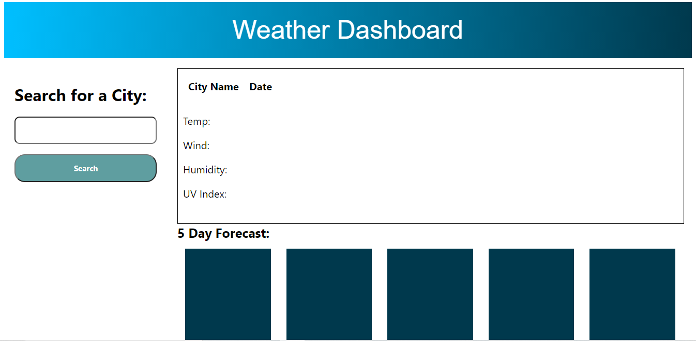
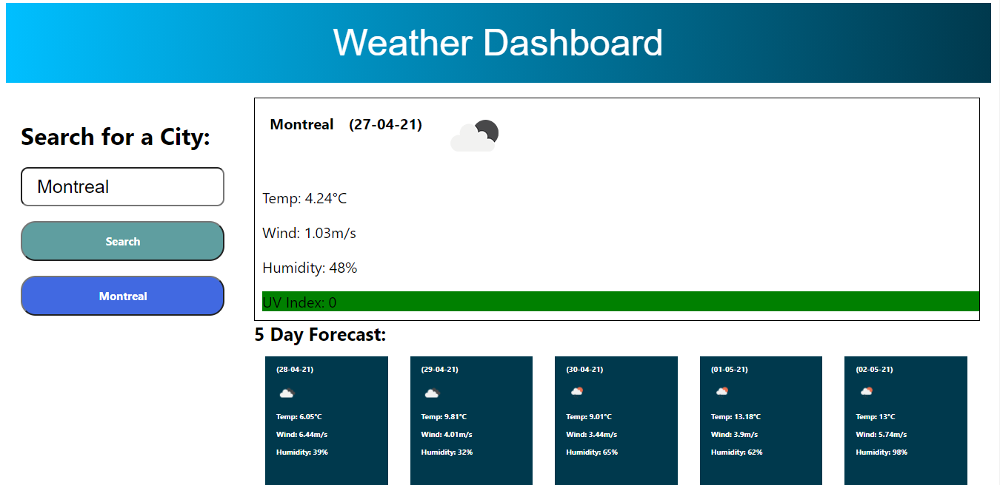

# Weather Dashboard- Don't Forget Your Umbrella!

## About

This application gives the user information on weather (both current and a five day forecast). Upon searching for a city, the dashboard is updated with temperature, wind speed, humidity, and a UV index (color coded depending on the value). The dashboard also includes an icon that changes depending on cloud cover and time of day (red sun for day, black/grey for night). A five day forecast is also updated at the bottom of the page. 

## Screenshots

Screenshot #1:

Screenshot #2:

## Links

- Live deploy of main on GitHub Pages: https://rorylkd.github.io/WeatherDashboard/ 

## Technology Used

- HTML
- Javascript
- CSS
- OpenWeather API

## License

- MIT

